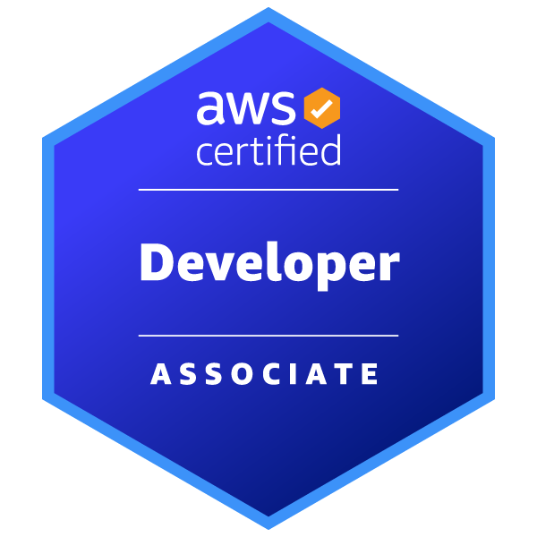

# Moin, I'm Maik 👋

I'm a Senior Software Engineer
at [SQUER Munich](https://www.squer.io/). Here’s
a bit about me:

## 🌟 About Me

I'm a dedicated Fullstack Developer with experience in both frontend and backend technologies. My skills include:

- **Languages**: Java, React/Next.js, Typescript, Rust
- **Technologies**: Spring Framework, Docker, AWS

## 🛠️ Certifications

- **iSAQB Certified Professional for Software Architecture (CPSA) - Foundation Level**
- **AWS Certified Developer - Associate**\
  

## 🚀 Projects and Contributions

I love learning new things by creating side projects that explore different technologies and solve interesting problems. Feel free to browse through my repositories to see what I've been working on!

## 🎲 Hobbies and Interests

Outside of work, I'm an avid enthusiast of tabletop role-playing games (TTRPGs) like **Dungeons and Dragons**.
I also just love Programming, it is not just my job but also my hobby, and I continually seek to expand my knowledge
through personal projects.

Feel free to reach out or explore my repositories to learn more about my work!
